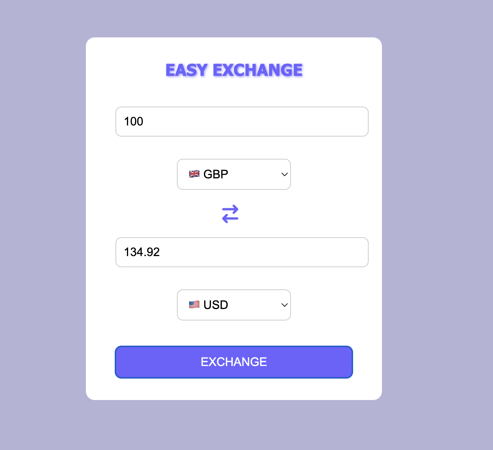

# Easy Exchange

A sleek and user-friendly **Easy Exchange** built with **React**, **CSS**, and **Axios**.  
Convert amounts between over 30 world currencies using real‑time exchange rates from the FreeCurrencyAPI.

---

## Screenshot

---

## Features

-Convert between 30+ global currencies  
-Real‑time exchange rates via FreeCurrencyAPI  
-Input validation (only numeric amounts)  
-Instantly swap “From” and “To” currencies  

---

## How It Works

1. Enter a numeric **amount**.  
2. Select a **From** currency and a **To** currency.  
3. Click **EXCHANGE** (or press ↵).  
4. The converted amount appears instantly.  
5. Change inputs or currencies to recalculate.

---

## Technologies Used

-React (with Hooks) – UI logic & state management

-Axios – HTTP requests to FreeCurrencyAPI

-CSS3 – Styling, flex layout, hover/focus effects

-react-icons – Swap icon for smooth UX

